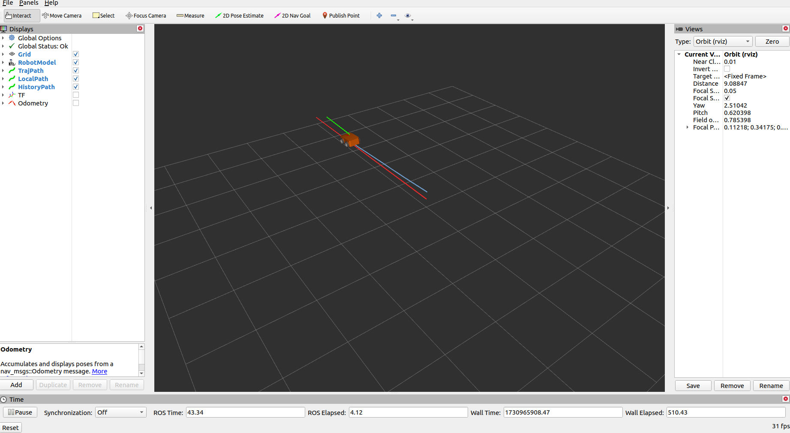
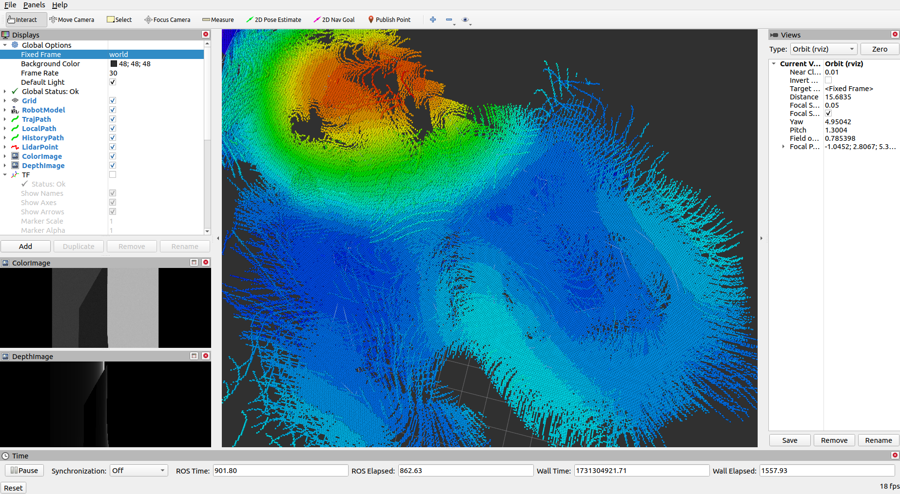

## 四轮差速仿真环境搭建方法

包含两个package: ```mpc_follower```和```skid4wd_description```

* ```mpc_follower```：使用MPC建立的planner和controller；发布参考轨迹。

* ```skid4wd_description```：主要用于搭建Gazebo环境中的车辆模型和环境模型，并处理里程计信息。车辆模型中包含两种传感器：IMU,二维激光雷达和Intel D435深度相机，但控制过程中用到的里程计信息是Gazebo中模型的位置和姿态。环境模型采用Blender进行建立，对应Blender文件在```skid4wd_description/urdf/terrain.blend```。






### 1.环境依赖安装

安装MPC控制器的优化库依赖包

```
pip3 install casadi  
```
安装rtabmap 建图依赖包
```
sudo apt install ros-noetic-rtabmap
sudo apt install ros-noetic-rtabmap-*
```
安装rviz octomap地图可视化插件
```
sudo apt-get install ros-noetic-octomap-rviz-plugins
```

### 2.仿真环境运行
将建立的地形模型复制到gazebo模型库所在位置
```
cd src/skid4wd_description/meshes/
cp -r Lawn/ ~/.gazebo/models
```

编译并添加环境
```
cd $your workspace$
catkin_make
source devel/setup.bash
```

运行斜坡仿真环境
```
roslaunch skid4wd_description sim_with_controller.launch
```

新建另外一个终端，运行建图文件,借助rtabmap和深度相机进行坡度建图

```
roslaunch skid4wd_description rs_rtabmap_d435.launch
```

新建另外一个终端，控制小车运动。包含两种控制模式：GUI控制和mpc_follower工具包控制，**两者选一个即可**
```
roslaunch skid4wd_description rqt_steering.launch   # GUI控制
roslaunch skid4wd_description mpc_planner.launch    # mpc_follower工具包控制
```

### 3. 文件结构
```
.
├── CMakeLists.txt -> /opt/ros/noetic/share/catkin/cmake/toplevel.cmake
├── figure
│   ├── gazebo.png
│   ├── map.png
│   ├── plotjuggler.png
│   └── rviz.png
├── mpc_follower                   # MPC Planner Package
│   ├── CMakeLists.txt
│   ├── launch
│   ├── package.xml
│   ├── scripts
│   │   ├── local_planner.py       # MPC_Traj_follower Node
│   │   ├── MPC.py                 # MPC class
│   │   └── traj_generate.py       # Generate Reference Trajectory Node
│   └── src
├── README.md
├── realsense_ros_gazebo        # realsense Package
└── skid4wd_description         # skid4wd Model and World Package
    ├── CMakeLists.txt
    ├── config
    │   ├── controller.yaml
    │   └── skid4wd_rviz.rviz
    ├── launch
    │   ├── controller.launch
    │   ├── mpc_planner.launch
    │   ├── rqt_steering.launch
    │   ├── rs_rtabmap_d435.launch
    │   ├── sim_with_controller.launch
    │   └── spawn.launch
    ├── meshes                  # car model and environment model
    │   ├── base_link.stl
    │   ├── Lawn                # Lawn Model
    │   │   ├── model.config
    │   │   └── model.sdf
    │   ├── livox-mid360.dae
    │   ├── wheel.dae
    │   ├── wheel_front_left_1.stl
    │   ├── wheel_front_right_1.stl
    │   ├── wheel_rear_left_1.stl
    │   └── wheel_rear_right_1.stl
    ├── package.xml
    ├── scripts
    │   └── odom_process.py
    ├── urdf
    │   ├── livox_mid360.urdf.xacro
    │   ├── materials.xacro
    │   ├── skid4wd.gazebo
    │   ├── skid4wd.trans
    │   ├── skid4wd.xacro
    │   ├── terrain.blend
    │   └── terrain.dae
    └── worlds
        ├── box_house.world
        ├── hometown_room.world
        ├── lawn_world.world
        └── slope_world.world
```

### 4.数据曲线显示工具

#### 4.1 rqt_plot 实时查看运行数据
```
rosrun rqt_plot rqt_plot
```

#### 4.2 plotjuggler 查看rosbag离线数据包 
 
安装PlotJuggler：
```
sudo apt-get install ros-noetic-plotjuggler
```

安装ros插件（不安装的话应该打不开.bag文件）
```
sudo apt-get install ros-noetic-plotjuggler-msgs ros-noetic-plotjuggler-ros
```

启动plotjuggler：
```
rosrun plotjuggler plotjuggler
```


