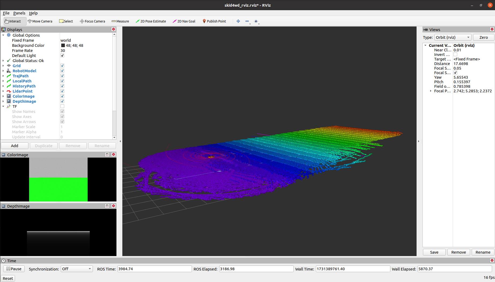
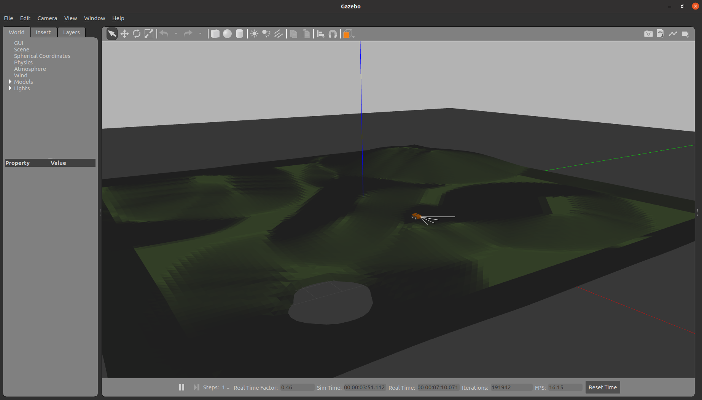

## 四轮差速仿真环境搭建方法

### 1.MPC Planner和RTabMap 实时建图

包含两个package: ```mpc_follower```和```skid4wd_description```

* ```mpc_follower```：使用MPC建立的planner和controller；发布参考轨迹。（对应launch文件和scripts文件已经迁移到mpc_controller工具包）

* ```skid4wd_description```：主要用于搭建Gazebo环境中的车辆模型和环境模型，并处理里程计信息。车辆模型中包含两种传感器：IMU,二维激光雷达和Intel D435深度相机，但控制过程中用到的里程计信息是Gazebo中模型的位置和姿态。环境模型采用Blender进行建立，对应Blender文件在```skid4wd_description/urdf/terrain.blend```。

#### 1.1 环境依赖安装

安装MPC控制器的优化库依赖包

```
pip3 install casadi  
```
安装rtabmap 建图依赖包
```
sudo apt install ros-noetic-rtabmap
sudo apt install ros-noetic-rtabmap-*
```
安装rviz octomap地图可视化插件
```
sudo apt-get install ros-noetic-octomap-rviz-plugins
```

#### 1.2 环境运行

将建立的地形模型复制到gazebo模型库所在位置
```
cd src/skid4wd_description/meshes/
cp -r Lawn/ ~/.gazebo/models
```

编译并添加环境
```
cd $your workspace$
catkin_make
source devel/setup.bash
```

运行斜坡仿真环境
```
roslaunch skid4wd_description sim_with_controller.launch
```

新建另外一个终端，运行建图文件,借助rtabmap和深度相机进行坡度建图

```
roslaunch skid4wd_description rs_rtabmap_d435.launch
```

新建另外一个终端，控制小车运动。包含两种控制模式：GUI控制和mpc_follower工具包控制，**两者选一个即可**
```
roslaunch skid4wd_description rqt_steering.launch      # GUI控制
roslaunch skid4wd_description mpc_controller.launch    # mpc_controller工具包控制
```

#### 1.3 演示效果

**rviz静态显示效果:**


**rviz动态显示效果:**


**gazebo复杂地形:**


### 2. uneven planner 

#### 2.1 环境依赖安装
环境依赖安装参考[uneven planner](https://github.com/ZJU-FAST-Lab/uneven_planner)

#### 2.2 环境运行

打开终端运行命令
```
roslaunch skid4wd_description sim_with_uneven.launch
```

#### 2.3 运行效果


