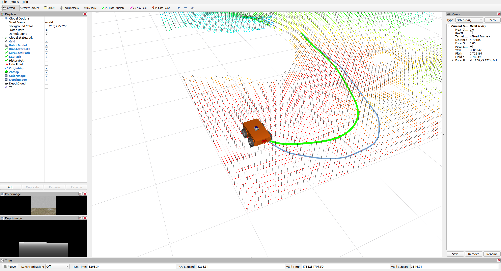

## 1. 概述

* 如何评估地形的可穿越性
* 如何应对与地形相关的机器人的动力学模型

提出一个针对类汽车机器人在不平坦地形上的轨迹优化框架，该框架可以同时考虑上述两个问题。生成的轨迹符合系统的动力学模型，既不过于保守，又能够被控制器很好地跟踪。 

### 2. 运动规划框架

 所有计算都在板载计算机 NVIDIA Jetson Nano 上执行。 我们使用 NOKOV 运动捕捉系统进行定位。 此外，MPC 控制器与位置反馈相匹配，用于机器人轨迹跟踪。 我们采用轻量级混合 A* 算法作为规划器的前端，并使用 Dubins 曲线来拍摄最终状态，以便更早地终止搜索过程。 此外，L-BFGS 的实现使用了开源库 LBFGS-Lite。 所有模拟都在配备 Intel i7-12700 CPU 的台式机上运行。



### 2.1 Hybrid A* 前端搜索


### 2.2 五次多项式轨迹优化

对Hybrid A* 前端搜索的路径进行路径插值，并使用五次多项式进行优化。

五次多项式优化成本函数考虑了三项：轨迹平滑惩罚项、接触约束和时间惩罚项。成本函数为 $τ=j​(t)^T​j​(t)+ρter⋅σ​(x​(t))+ρ​(t)$，其中 $j​(t)=x^{(3)}​(t)$ 表示轨迹的加加速度，其平方积分表示轨迹的平滑度。$ρ_{ter}$ 为常数, $σ​(x​(t))$ 是表面变化，用于近似地形曲率，它可以在计算地形位姿映射 $ℱ$ 的同时获得，因为 $σ​(x)=λ_0/∑_{i=0}^{2}λ_i$，其中 $λ_0≤λ_1≤λ_2$ 是靠近 $x$ 的椭球区域中点的协方差矩阵的特征值。 $ρ$是时间正则化, 成本函数是轨迹的总时间。

五次多项式优化项为系数矩阵和时间向量。$c_{x​y}=[[c_{x1},c_{y1}]^T,[c_{x2},c_{y2}]^T,…,[c_{xM},c_{yM}]^T]^T∈ℝ^{6​M×2},c_θ=[c_{θ1}^T,c_{θ2}^T,…,c_{θΩ}^T]^T∈ℝ^{6​Ω×1}$ 为系数矩阵(6表示五次多项式的系数个数)，$M$ 和 $Ω$ 分别表示 $x,y$ 和 $θ$ 的分段多项式的片段数量。 在本文中，我们使 $θ$ 的轨迹具有更多片段（即 $Ω>M$），以便更好地拟合非完整约束 (29)。$T_{x​y}=[T_{1​x​y},T_{2​x​y},…,T_{​Mx​y}]^T∈ℝ^M，T_{θ}=[T_{1​θ},T_{2​θ},…,T_{Ω​θ}]T∈ℝ^Ω$ 为时间向量，满足 $ ∥T_{x​y}∥_1=∥T_θ∥_1=T_s $。 

#### 2.2.1 轨迹平滑惩罚项

五次多项式的轨迹为

$$p_i​(t)=c_{i,0}​+c_{i,1}​t+c_{i,2}​t^2+⋯+c_{i,5}​t^5,t∈[0,T_i​]$$

##### 梯度计算：

关于系数 c 的梯度计算：每段轨迹的 j(t) 可由多项式系数直接导出：$j(t)=6c_3​+24c_4​t+60c_5​t^2$.
成本 J 对 c 的梯度由链式法则得到：$\frac{∂J}{∂c_k}=∫_0^T2j(t)\frac{∂j(t)}{∂c_k} dt$
代码中将 $\frac{∂J}{∂c}$​ 分别计算了 $c_3,c_4,c_5$​ 的梯度，并且根据每段轨迹的 T 值调整权重，梯度存储到 gdC 中。

关于时间 T 的梯度计算：成本函数对时间的梯度为：$\frac{∂J}{∂T}=j^2(T_i)−j^2(0)+∫_0^{T_i}\frac{∂j^2(t)}{∂T} dt$
```
inline void calJerkGradCT(Eigen::MatrixXd& gdC, Eigen::VectorXd &gdT) 
{
    // 计算jerk对系数矩阵的偏导 ∂J/∂c
    gdC.resize(6 * N, Dim); 
    for (int i = 0; i < N; i++)
    {
        gdC.row(6 * i + 5) = 240.0 * c.row(6 * i + 3) * T3(i) +
                                720.0 * c.row(6 * i + 4) * T4(i) +
                                1440.0 * c.row(6 * i + 5) * T5(i);
        gdC.row(6 * i + 4) = 144.0 * c.row(6 * i + 3) * T2(i) +
                                384.0 * c.row(6 * i + 4) * T3(i) +
                                720.0 * c.row(6 * i + 5) * T4(i);
        gdC.row(6 * i + 3) = 72.0 * c.row(6 * i + 3) * T1(i) +
                                144.0 * c.row(6 * i + 4) * T2(i) +
                                240.0 * c.row(6 * i + 5) * T3(i);
        gdC.block<3, Dim>(6 * i, 0).setZero();
    }

    // 计算jerk对系数矩阵的偏导 ∂J/∂T
    gdT.resize(N);
    for (int i = 0; i < N; i++)
    {
        gdT(i) = 36.0 * c.row(6 * i + 3).squaredNorm() +
                    288.0 * c.row(6 * i + 4).dot(c.row(6 * i + 3)) * T1(i) +
                    576.0 * c.row(6 * i + 4).squaredNorm() * T2(i) +
                    720.0 * c.row(6 * i + 5).dot(c.row(6 * i + 3)) * T2(i) +
                    2880.0 * c.row(6 * i + 5).dot(c.row(6 * i + 4)) * T3(i) +
                    3600.0 * c.row(6 * i + 5).squaredNorm() * T4(i);
    }
    return;
}
```

##### 代价计算：

轨迹的 jerk代价 JJ 是抖动平方积分的累积，定义如下：$J=∫_0^T​j^2(t)dt$

```
inline double getTrajJerkCost() const
{
    double energy = 0.0;
    for (int i = 0; i < N; i++)
    {
        energy += 36.0 * c.row(6 * i + 3).squaredNorm() * T1(i) +
                    144.0 * c.row(6 * i + 4).dot(c.row(6 * i + 3)) * T2(i) +
                    192.0 * c.row(6 * i + 4).squaredNorm() * T3(i) +
                    240.0 * c.row(6 * i + 5).dot(c.row(6 * i + 3)) * T3(i) +
                    720.0 * c.row(6 * i + 5).dot(c.row(6 * i + 4)) * T4(i) +
                    720.0 * c.row(6 * i + 5).squaredNorm() * T5(i);
    }
    return energy;
}
```

### 2.2.2 地形曲率惩罚项(地形位姿映射)

通过地形和车辆位姿态将SE(2)映射到SE(3)，即将$(x,y,theta)$映射到$(x,y,z,x_b,y_b,z_b)$。通过使用迭代平面拟合策略，同时考虑机器人的尺寸和姿态，从点云中获得映射 $ℱ$。

**初始化**：对于一个 $S​E​(2)$ 状态，zb 首先被初始化为 $b_3=(0，0，1)$，然后我们在点云中搜索一个 $(x,y)$ 坐标最接近的邻近点，并使用该点的海拔作为 z 的初始值。 因此，可以得到机器人对应的 $S​E​(3)$ 状态。 

**更新**： 将取出与机器人尺寸、位置和姿态相关的椭球区域中的点。 因此，$z_b$ 将由其协方差矩阵的最小特征值对应的特征向量更新，$z$ 将由这些点海拔的平均值更新，这使我们能够获得下次迭代的新椭球区域。

#### $z_b$ 将由其协方差矩阵的最小特征值对应的特征向量更新
当从点云数据中选取一个区域时，该区域内点的分布可以通过协方差矩阵来描述。协方差矩阵的特征值反映点分布在对应特征向量方向上的扩展程度。较大的特征值表示点在该方向上分布较分散，较小的特征值表示点在该方向上分布较集中。协方差矩阵的特征向量：指示点分布的主轴方向。

在点云中的一个椭球区域内，最小特征值对应的特征向量往往近似表示局部表面的法向量：假设点云中的点形成某种表面（例如地形、障碍物表面），法向量是描述表面方向的重要信息。协方差矩阵的最小特征向量因为与最小特征值对应，表示点分布变化最小的方向，这通常与表面法向垂直一致。


### 2.2.3 MINCO（Minimum-Time Coefficient Polynomial）


### 参考文献
[1] https://arxiv.org/abs/2409.07924
[2] https://arxiv.org/abs/2309.06115
[3] Z. Jian et al., "PUTN: A Plane-fitting based Uneven Terrain Navigation Framework," 2022 IEEE/RSJ International Conference on Intelligent Robots and Systems (IROS), Kyoto, Japan, 2022, pp. 7160-7166, doi: 10.1109/IROS47612.2022.9981038.