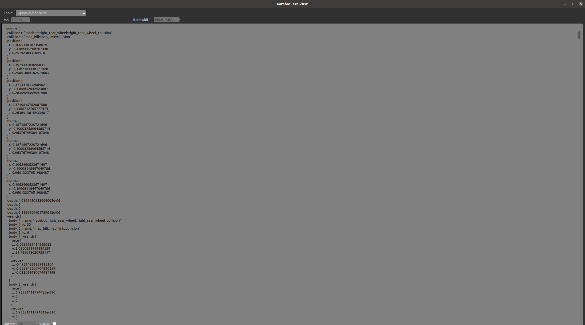
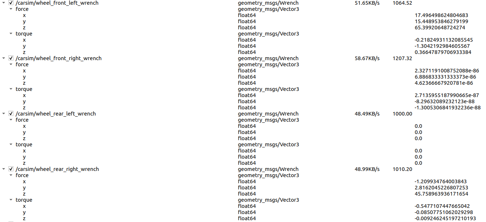
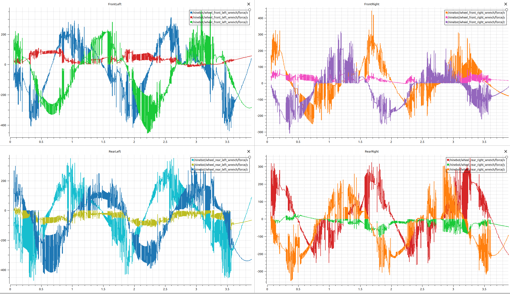

# 【Gazebo】读取接触点处的力&力矩

在Gazebo仿真器中读取车轮和地面接触点力和力矩，可采用是使用力/力矩传感器和接触传感器，但是在配置urdf文件时候一直没配置成功。最后选择直接在gazebo发布的topic进行读取， 然后使用ROS topic将接触点力和力矩发布出去。

**Gazebo topic和 ROS topic之间关系**： Gazebo 本身是一个物理引擎和仿真环境，它并没有原生支持 ROS 的通信机制。为了使 Gazebo 能够与 ROS 进行互动，Gazebo 使用一个称为 gazebo_ros_pkgs 的 ROS 包（即 gazebo_ros 插件）来实现与 ROS 通信。这些插件帮助 Gazebo 发布传感器数据到 ROS topic，或者从 ROS topic 接收命令。Gazebo 提供了与 ROS 集成的插件，这些插件会自动将 Gazebo 仿真中的数据通过 ROS topic 发布，或者接收来自 ROS topic 的指令，这些插件就是对应的传感器插件。

如果不通过传感器插件，直接从 Gazebo 中读取数据也是可行的，因为在配置力/力矩传感器和接触传感器没有成功，所以就介绍一下直接才能够Gazebo中读取对应的接触数据。

## 查看对应topic

使用```gz topic --list```命令可以列出全部Gazebo对应的topic，关注的Gazebo topic为
```
/gazebo/default/physics/contacts
```
可以使用```gz topic --view /gazebo/default/physics/contacts``` 查看一下对应的数据，    "/gazebo/default/physics/contacts"是 Gazebo 中发布物体接触信息的 topic。每当 Gazebo 仿真中的物体发生碰撞时，物理引擎就会发布碰撞数据到这个 topic。消息类型通常是 gazebo::msgs::Contacts，它包含了多个物体之间的碰撞信息，如力、位置、接触的物体等。



在 Gazebo 中，gazebo::transport 是用于与 Gazebo 仿真环境进行通信的 API。通过 Gazebo Transport 系统，用户可以发布、订阅消息并与仿真世界进行互动。

## 读取对应topic

### 主函数里面对应程序

```C++
gazebo::client::setup(_argc, _argv);

gazebo::transport::NodePtr node(new gazebo::transport::Node());
node->Init();

gazebo::transport::SubscriberPtr sub = node->Subscribe("/gazebo/default/physics/contacts", forcesCb);
```

```gazebo::client::setup(_argc, _argv)```是初始化 Gazebo 客户端 API 的必要步骤，特别是在编写 Gazebo 插件时。它设置了与 Gazebo 仿真环境通信所需的底层网络和配置。

* 作用：初始化 Gazebo 客户端以便与 Gazebo 仿真进行交互。
* 参数：_argc 和 _argv 是传递给主程序的命令行参数，通常会传递给 main 函数。

```gazebo::transport::NodePtr node(new gazebo::transport::Node());```创建了一个新的 transport node。在 Gazebo 中，gazebo::transport::Node 是用于发布和订阅消息的基本组件。 Node 是一个用于进行消息通信的对象，它可以向特定的 topic 发布消息，或者订阅 topic 来接收来自其他节点的消息。


```node->Init();```初始化 Node 对象，使其能够开始与 Gazebo 的消息总线进行通信。具体来说，它会连接到 Gazebo 仿真系统的通信网络，并准备开始接收和发送消息。

```gazebo::transport::SubscriberPtr sub = node->Subscribe("/gazebo/default/physics/contacts", forcesCb);```订阅了一个特定的 Gazebo topic，该 topic 用于发布物理引擎中物体之间的接触（collision）信息。通过订阅该 topic，插件可以接收到所有物体接触相关的数据。forcesCb：这是一个回调函数，当 Gazebo 在该 topic 上发布消息时，forcesCb 函数将被调用。这个回调函数会接收到碰撞数据，并允许你在回调函数内处理这些数据。

### 回调函数对应程序

``` C++
void forcesCb(ConstContactsPtr &_msg){
    // 遍历所有接触信息
    for (int i = 0; i < _msg->contact_size(); ++i) {

        // 获取第 i 个接触的第一个和第二个碰撞体
        std::string collision_1 = _msg->contact(i).collision1();
        std::string collision_2 = _msg->contact(i).collision2();

        // 获取法向量 (normal) 的 x, y, z 分量
        double normal_x = _msg->contact(i).normal().Get(0).x();
        double normal_y = _msg->contact(i).normal().Get(0).y();
        double normal_z = _msg->contact(i).normal().Get(0).z();

        // 获取接触点 (position) 的 x, y, z 分量
        double position_x = _msg->contact(i).position().Get(0).x();
        double position_y = _msg->contact(i).position().Get(0).y();
        double position_z = _msg->contact(i).position().Get(0).z();

        // 获取作用力 (force)，这里是 body_1_wrench 的 force 部分
        double force_x = _msg->contact(i).wrench(0).body_1_wrench().force().x();
        double force_y = _msg->contact(i).wrench(0).body_1_wrench().force().y();
        double force_z = _msg->contact(i).wrench(0).body_1_wrench().force().z();

            // 获取作用力矩 (torque)，这里是 body_1_wrench 的 torque 部分
        double force_x = _msg->contact(i).wrench(0).body_1_wrench().torque().x();
        double force_y = _msg->contact(i).wrench(0).body_1_wrench().torque().y();
        double force_z = _msg->contact(i).wrench(0).body_1_wrench().torque().z();

        // 获取接触深度（depth）
        double depth = _msg->contact(i).depth().Get(0);
    }
}
```

```contact_size()``` 是一个方法，用于返回接触消息中包含的接触点的数量。

```collision1()``` 和 ```collision2()``` 返回发生碰撞的两个物体的碰撞体（collision object）。这些碰撞体代表了在仿真环境中发生接触的物体。```collision1()```：返回第一个发生碰撞的物体的碰撞体。```collision2()```：返回第二个发生碰撞的物体的碰撞体。

每次发生碰撞时，Gazebo 会计算碰撞表面的法线，即表面方向的向量。法向量的方向通常指向外部物体（从一个物体指向另一个物体）。通过 ```normal()``` 方法，我们可以获取到碰撞表面的法向量。Get(0) 方法用于提取法向量的三个分量，分别对应 x、y 和 z。

```position()``` 方法返回碰撞发生的接触点位置，即两个物体表面首次接触的点。与法向量类似，接触位置也是一个三维向量，包含 x、y 和 z 坐标。

碰撞时，不仅存在法线方向的分量，还有作用在物体上的力。我们可以通过 ```wrench()``` 方法获取物体在碰撞时的力和力矩。```body_1_wrench().force()``` 返回作用力的三维向量。```body_1_wrench().torque()``` 返回作用力矩三维向量。

```depth()```接触深度表示物体之间的重叠程度，它是一个标量值，指示两个物体是否发生了碰撞。如果深度值为正，则表示物体正在发生重叠。



